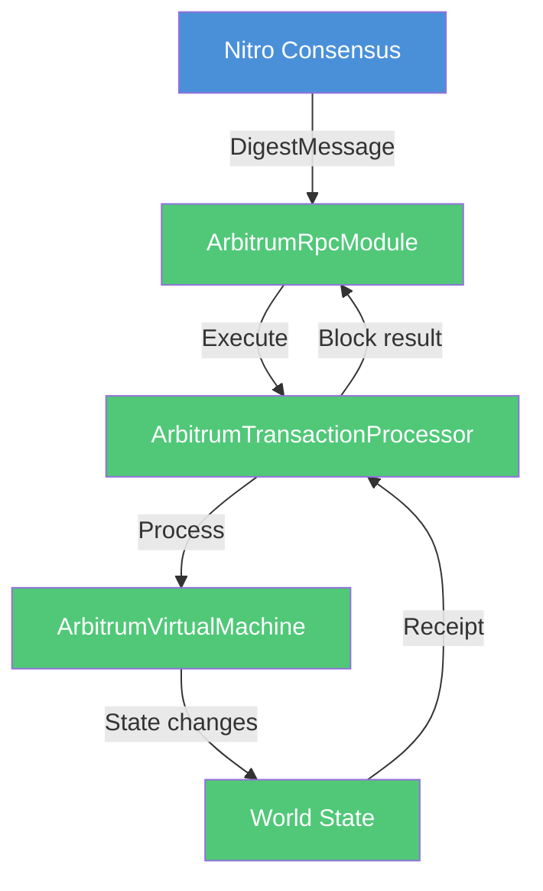

Generate a Mermaid diagram to visualize the requested concept.

## Request: $ARGUMENTS

## Your Task

### 1. Analyze the Concept
Determine what type of diagram best represents it:
- **Process/flow** → Flowchart (`graph TD` or `graph LR`)
- **Interactions** → Sequence diagram
- **Structure/relationships** → Class diagram
- **States/lifecycle** → State diagram
- **File mappings** → Flowchart with subgraphs

### 2. Gather Context (if needed)
If the concept relates to code:
- Read relevant source files from Nitro and/or Nethermind
- Identify key components, relationships, and flows
- Note file paths and line numbers for references

### 3. Generate Diagram
Output a Mermaid code block with:
- **Descriptive labels** (not just A, B, C)
- **Color coding**:
  - Blue (`#4a90d9`) for Nitro/Go components
  - Green (`#50c878`) for Nethermind/C# components
  - Orange (`#ffa500`) for external/user interactions
- **Clear flow direction**

### 4. Provide Context
Include:
- Brief explanation of what the diagram shows
- Key insights highlighted
- Related file references (if code-related)

## Output Format

```markdown
## [Concept] Visualization

### Overview
[Brief description of what the diagram shows]

### Diagram

```mermaid
[diagram type]
    [content]
    [styling]
```

### Key Points
- [Important insight 1]
- [Important insight 2]

### Related Files (if applicable)
- Nitro: `path/file.go:lines`
- Nethermind: `path/file.cs:lines`
```

## Example Usage

**Input**: `/visualize transaction processing flow`

**Output**:


## Common Visualizations

| Request | Diagram Type |
|---------|--------------|
| "transaction flow" | Flowchart |
| "RPC communication" | Sequence |
| "component architecture" | Class |
| "ArbOS state machine" | State |
| "file mappings Nitro to Nethermind" | Subgraph |
| "precompile execution" | Flowchart |
| "agent orchestration" | Flowchart |

## Remember
- Keep diagrams focused (one concept per diagram)
- Use consistent color coding
- Add file references for code-related diagrams
- Mermaid code blocks render in most viewers
