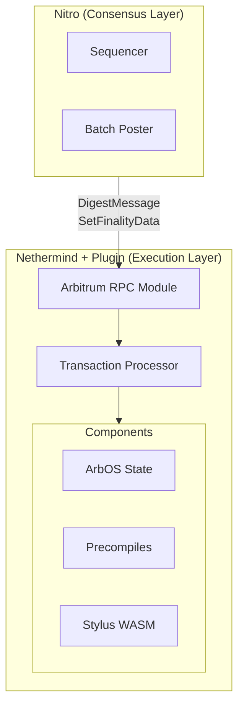

<p align="center">
  <picture>
    <source media="(prefers-color-scheme: dark)" srcset="https://github.com/nethermindeth/nethermind/assets/337518/3e3b3c06-9cf3-4364-a774-158e649588cc">
    <source media="(prefers-color-scheme: light)" srcset="https://github.com/nethermindeth/nethermind/assets/337518/d1cc365c-6045-409f-a961-18d22ddb2535">
    
  </picture>
</p>

# Nethermind Arbitrum Plugin

[](https://github.com/NethermindEth/nethermind-arbitrum/actions/workflows/build.yml)
[](https://github.com/NethermindEth/nethermind-arbitrum/actions/workflows/format.yml)
[](https://github.com/NethermindEth/nethermind-arbitrum/actions/workflows/test.yml)
[](https://github.com/NethermindEth/nethermind-arbitrum/actions/workflows/scorecard.yml)
[](https://codecov.io/gh/NethermindEth/nethermind-arbitrum)
[](LICENSE.md)

Nethermind Arbitrum Plugin enables execution layer functionality for Arbitrum rollups, providing client diversity for the Arbitrum ecosystem.

## Quick Start

### Prerequisites

- .NET SDK 10.0+ ([download](https://dotnet.microsoft.com/download))
- Access to Ethereum L1 RPC endpoint
- [Nitro](https://github.com/OffchainLabs/nitro) consensus client

### Running with Docker

**Build the image:**

```bash
docker build -t nethermind-arbitrum .
```

**Run standalone (execution layer only):**

```bash
docker run -d \
  --name nethermind-arbitrum \
  -p 8545:8545 \
  -p 8551:8551 \
  -v ./data:/data \
  -v ./logs:/app/logs \
  nethermind-arbitrum \
  -c arbitrum-sepolia-archive \
  --data-dir /data \
  --JsonRpc.Host=0.0.0.0
```

**Run with Nitro (full node via Docker Compose):**

```bash
# Copy and configure environment variables
cp .env.example .env
# Edit .env with your L1 RPC and Beacon URLs

# Start both Nethermind and Nitro
docker compose up -d
```

### Building from Source

```bash
# Clone with submodules
git clone --recursive https://github.com/NethermindEth/nethermind-arbitrum.git
cd nethermind-arbitrum

# Build
dotnet build src/Nethermind.Arbitrum/Nethermind.Arbitrum.csproj

# Run tests
dotnet test src/Nethermind.Arbitrum.Test/Nethermind.Arbitrum.Test.csproj
```

## JWT Authentication

Production deployments require JWT authentication between Nitro (consensus) and Nethermind (execution) for secure RPC communication on port 20551 (Engine API).

### Setup

1. **Start Nethermind** with a JWT secret path:
   ```bash
   # Using Makefile (defaults to ~/.arbitrum/jwt.hex)
   make run-sepolia

   # Or manually
   dotnet nethermind.dll -c arbitrum-sepolia-archive --JsonRpc.JwtSecretFile=~/.arbitrum/jwt.hex
   ```
   Nethermind auto-generates the JWT secret if the file doesn't exist.

2. **Configure Nitro** with the same secret:
   ```bash
   --node.execution-rpc-client.url=http://localhost:20551
   --node.execution-rpc-client.jwtsecret=$HOME/.arbitrum/jwt.hex
   ```

Both clients must use the same secret file.

### Custom JWT Path

Override the default path via Makefile or CLI:
```bash
# Makefile
make run-sepolia JWT_FILE=/custom/path/jwt.hex

# CLI
--JsonRpc.JwtSecretFile=/custom/path/jwt.hex
```

Or generate your own secret:
```bash
mkdir -p ~/.arbitrum && openssl rand -hex 32 > ~/.arbitrum/jwt.hex
```

### Development Mode

For local development, use the unsafe targets which disable authentication:
```bash
make run-local          # No JWT (arbitrum-local config)
make run-system-test    # No JWT (system test config)
make run-sepolia-unsafe # No JWT (Sepolia network)
make run-mainnet-unsafe # No JWT (Mainnet network)
```

**Do not use unsafe mode in production.**

### RPC Module Security

In production configs, the `arbitrum` and `nitroexecution` RPC namespaces are only available on the JWT-protected Engine port (20551), not on the public RPC port (20545). This ensures that sensitive consensus-related methods are only accessible to authenticated clients (Nitro).

| Port | Modules | Authentication |
|------|---------|----------------|
| 20545 (public) | eth, net, web3, debug, trace, txpool, etc. | None |
| 20551 (engine) | arbitrum, nitroexecution + above | JWT required |

For local development configs (`arbitrum-local`), both ports have all modules enabled with authentication disabled.

## Docker Compose Configuration

The repository includes production-ready Docker Compose configuration.

### Quick Start

1. **Copy environment template:**
   ```bash
   cp .env.example .env
   ```

2. **Configure L1 endpoints** in `.env`:
   ```bash
   PARENT_CHAIN_RPC_URL=http://your-l1-rpc:8545
   PARENT_CHAIN_BEACON_URL=http://your-l1-beacon:4000
   ```

3. **Start services:**
   ```bash
   docker compose up -d
   ```

JWT authentication is enabled by default. Nethermind auto-generates the JWT secret on first run.

### Network Selection

Set the `NETWORK` and `CHAIN_ID` environment variables:

| Network | NETWORK | CHAIN_ID |
|---------|---------|----------|
| Arbitrum One | `arbitrum-mainnet` | 42161 |
| Arbitrum One (archive) | `arbitrum-mainnet-archive` | 42161 |
| Arbitrum Sepolia | `arbitrum-sepolia` | 421614 |
| Arbitrum Sepolia (archive) | `arbitrum-sepolia-archive` | 421614 |

### Volumes

| Path | Purpose |
|------|---------|
| `./nethermind-data` | Blockchain database and JWT secret |
| `./nitro-data` | Nitro consensus data |

### Environment Variables

| Variable | Required | Default | Description |
|----------|----------|---------|-------------|
| `PARENT_CHAIN_RPC_URL` | Yes | - | L1 RPC endpoint |
| `PARENT_CHAIN_BEACON_URL` | Yes | - | L1 Beacon endpoint |
| `NETWORK` | No | `arbitrum-mainnet` | Nethermind config |
| `CHAIN_ID` | No | `42161` | Arbitrum chain ID |
| `NETHERMIND_IMAGE` | No | `nethermind/nethermind-arbitrum:0.0.1-alpha` | Execution client image |
| `NITRO_IMAGE` | No | `offchainlabs/nitro-node:v3.10.0-rc.1-3a25bb0` | Consensus client image |
| `LOG_LEVEL` | No | `INFO` | Nitro log level |

## Supported Networks

| Network | Config | Chain ID |
|---------|--------|----------|
| Arbitrum One | `arbitrum-mainnet` | 42161 |
| Arbitrum One (archive) | `arbitrum-mainnet-archive` | 42161 |
| Arbitrum Sepolia | `arbitrum-sepolia` | 421614 |
| Arbitrum Sepolia (archive) | `arbitrum-sepolia-archive` | 421614 |

## Architecture

Arbitrum nodes consist of two components:
- **Nitro** (consensus layer) - Rollup node developed by Offchain Labs
- **Nethermind** (execution layer) - This plugin



## Configuration

| Option | Description | Default |
|--------|-------------|---------|
| `--Arbitrum.SafeBlockWaitForValidator` | Wait for validator for safe blocks | `false` |
| `--Arbitrum.FinalizedBlockWaitForValidator` | Wait for validator for finalized blocks | `false` |
| `--Arbitrum.BlockProcessingTimeout` | Block processing timeout (seconds) | `1` |
| `--Arbitrum.RebuildLocalWasm` | WASM rebuild mode (false/force/auto) | `auto` |
| `--Arbitrum.MessageLagMs` | Allowed message lag while synced (ms) | `1000` |
| `--Arbitrum.ExposeMultiGas` | Expose multi-dimensional gas in receipts | `false` |

## Documentation

- [Architecture Overview](docs/ARCHITECTURE.md) - Component design and data flows
- [RPC API Reference](docs/RPC-API.md) - Nitro communication methods
- [Precompiles Reference](docs/PRECOMPILES.md) - Arbitrum precompile addresses
- [Development Guide](docs/DEVELOPMENT.md) - Build, test, and contribute
- [User Documentation](https://docs.nethermind.io/running-node/arbitrum) - Running a node

## Project Structure

```
nethermind-arbitrum/
├── src/
│   ├── Nethermind/                    # Nethermind submodule (read-only)
│   ├── Nethermind.Arbitrum/           # Plugin source code
│   │   ├── Arbos/                     # ArbOS state management
│   │   ├── Config/                    # Configuration types
│   │   ├── Data/                      # Transaction types
│   │   ├── Evm/                       # EVM modifications
│   │   ├── Execution/                 # Block/transaction processing
│   │   ├── Genesis/                   # Genesis initialization
│   │   ├── Modules/                   # RPC modules
│   │   ├── Precompiles/               # Arbitrum precompiles
│   │   ├── Stylus/                    # WASM store management
│   │   └── Properties/                # Configs & chainspecs
│   └── Nethermind.Arbitrum.Test/      # Test suite
├── docs/                              # Developer documentation
└── CLAUDE.md                          # AI assistant context
```

## Key Features

- **Full Arbitrum Protocol Support** - Complete implementation of Arbitrum One and Sepolia
- **Stylus/WASM Execution** - WebAssembly smart contracts (ArbOS v30+)
- **16 Precompiles** - All standard Arbitrum system contracts
- **Multi-dimensional Gas** - Support for Arbitrum's gas model

## Contributing

1. Fork the repository
2. Create a feature branch
3. Follow the coding guidelines in [CLAUDE.md](CLAUDE.md)
4. Submit a pull request

## License

Business Source License 1.1 - See [LICENSE](LICENSE.md) for details.

## Resources

- [Arbitrum Documentation](https://docs.arbitrum.io/)
- [Nethermind Documentation](https://docs.nethermind.io/)
- [Nitro Source Code](https://github.com/OffchainLabs/nitro)
