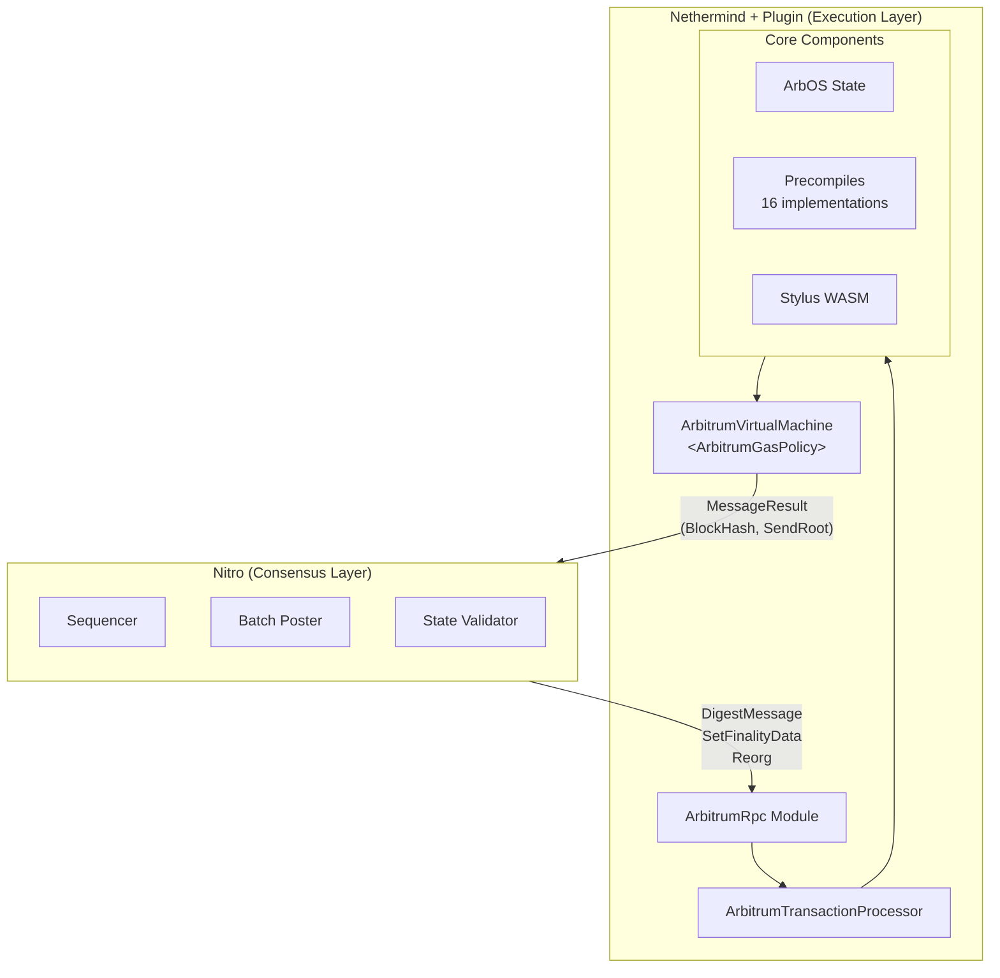
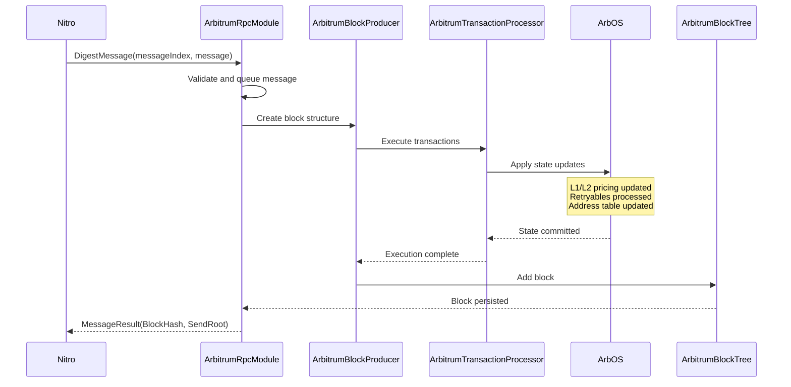
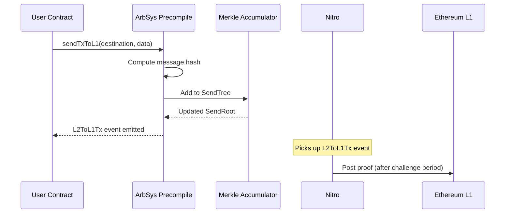

# Nethermind Arbitrum Architecture

## Overview

The Nethermind Arbitrum plugin implements the execution layer for Arbitrum rollups, working alongside Nitro (consensus layer) to provide a complete L2 node.

## System Architecture



## Key Components

### 1. RPC Modules

**Location:** `src/Nethermind.Arbitrum/Modules/`

The plugin provides two RPC namespaces implementing the interface defined by Nitro:

| Namespace | Status | Description |
|-----------|--------|-------------|
| `nitroexecution` | **Primary** | Nitro ExecutionClient interface with flat parameters |
| `arbitrum` | Legacy | Wrapped parameters, maintained for legacy development tools |

Both share the same `ArbitrumExecutionEngine` backend. New integrations should use `nitroexecution`.

**Core Methods:**

| Method | Description |
|--------|-------------|
| `DigestInitMessage` | Initialize genesis state from Nitro - Deprecated |
| `DigestMessage` | Process message and produce block |
| `Reorg` | Handle chain reorganization |
| `SetFinalityData` | Update safe/finalized block info |
| `SetConsensusSyncData` | Update sync status from CL |
| `MessageIndexToBlockNumber` | Convert message index to block number - Deprecated |
| `BlockNumberToMessageIndex` | Convert block number to message index - Deprecated |
| `ResultAtMessageIndex` | Get block result at message index |
| `HeadMessageIndex` | Get head message index |
| `MarkFeedStart` | Mark feed start for L1 price data |
| `Synced` | Check if node is synced - Deprecated |
| `FullSyncProgressMap` | Get detailed sync progress - Deprecated|
| `ArbOSVersionForMessageIndex` | Get ArbOS version for message |
| `MaintenanceStatus` | Get maintenance status |
| `ShouldTriggerMaintenance` | Check if maintenance needed |
| `TriggerMaintenance` | Trigger maintenance operations |

See [RPC-API.md](RPC-API.md) for complete method documentation.

### 2. ArbOS (Arbitrum Operating System)

**Location:** `src/Nethermind.Arbitrum/Arbos/`

ArbOS manages L2 state including:
- **L1/L2 Gas Pricing** - Dynamic pricing based on L1 conditions
- **Retryable Tickets** - L1-to-L2 message management
- **Address Tables** - Address compression for efficiency
- **Merkle Accumulator** - L2-to-L1 message proofs
- **Feature Flags** - Version-gated functionality

**ArbOS Versions:**

| Version | Features |
|---------|----------|
| v10 | L1 pricing improvements |
| v20 | Enhanced batch posting |
| v30 | Stylus/WASM support |
| v40 | Parent block hash processing |
| v41 | Native token management |
| v50 | Multi-constraint and milti-gas tracking |

### 3. Precompiles

**Location:** `src/Nethermind.Arbitrum/Precompiles/`

Precompiles are special smart contracts at fixed addresses providing system-level functionality, implemented natively for performance.

| Address | Name | Purpose |
|---------|------|---------|
| `0x64` | ArbSys | System info, L2-to-L1 messaging, block info |
| `0x65` | ArbInfo | Account balance and code queries |
| `0x66` | ArbAddressTable | Address compression for gas efficiency |
| `0x67` | ArbBLS | BLS signatures (deprecated) |
| `0x68` | ArbFunctionTable | Function signature registry |
| `0x69` | ArbTest | Testing utilities (dev only) |
| `0x6b` | ArbOwnerPublic | Public chain owner queries |
| `0x6c` | ArbGasInfo | Gas pricing information |
| `0x6d` | ArbAggregator | Batch poster configuration |
| `0x6e` | ArbRetryableTx | Retryable ticket management |
| `0x6f` | ArbStatistics | Chain statistics |
| `0x70` | ArbOwner | Chain owner operations (admin only) |
| `0x71` | ArbWasm | Stylus program deployment & activation |
| `0x72` | ArbWasmCache | WASM caching control |
| `0x73` | ArbNativeTokenManager | Native token minting/burning |
| `0xff` | ArbDebug | Debug utilities |

**Virtual Contracts** (not true precompiles):
| Address | Name | Purpose |
|---------|------|---------|
| `0xc8` | NodeInterface | Node query interface |
| `0xc9` | NodeInterfaceDebug | Debug node queries |

**Implementation Pattern:** Each precompile has two files:
- `ArbXxx.cs` - Business logic (static methods, gas accounting, state mutations)
- `ArbXxxParser.cs` - ABI encoding/decoding (method selectors, frozen dictionary dispatch)

**Version Gating:**
| Feature | Min ArbOS | Precompile |
|---------|-----------|------------|
| Stylus program activation | v30 | ArbWasm |
| WASM cache management | v30 | ArbWasmCache |
| Native token management | v41 | ArbNativeTokenManager |
| Multi-constraint gas info | v50 | ArbGasInfo |

See [Arbitrum Precompiles Documentation](https://docs.arbitrum.io/build-decentralized-apps/precompiles/overview) for official reference.

### 4. Stylus/WASM Execution

**Locations:**
- `src/Nethermind.Arbitrum/Stylus/` - Store and database management
- `src/Nethermind.Arbitrum/Arbos/Stylus/` - Native interop

Stylus enables WebAssembly smart contracts compiled from Rust, C++, or other languages.

**Native Libraries:**
- `libstylus.so` (Linux x64/arm64)
- `libstylus.dylib` (macOS arm64)
- `stylus.dll` (Windows x64)

### 5. Transaction Types

The plugin handles six Arbitrum-specific transaction types:

| Type | Description |
|------|-------------|
| `ArbitrumInternalTx` | Internal system transactions |
| `ArbitrumDepositTx` | L1-to-L2 deposits |
| `ArbitrumUnsignedTx` | Unsigned L1 messages |
| `ArbitrumRetryTx` | Retryable ticket redemptions |
| `ArbitrumSubmitRetryableTx` | Submit retryable tickets |
| `ArbitrumContractTx` | Contract-initiated transactions |

## Data Flow

### Block Production Flow



### L2-to-L1 Messaging Flow



## Plugin Initialization

The plugin follows the Nethermind plugin architecture:

```csharp
public class ArbitrumPlugin : IConsensusPlugin
{
    // Entry point - configures the plugin
    Task Init(INethermindApi api);

    // Registers Arbitrum RPC module
    Task InitRpcModules();

    // Creates block producer
    IBlockProducer InitBlockProducer();

    // Creates block producer runner
    IBlockProducerRunner InitBlockProducerRunner(IBlockProducer blockProducer);

    // Registers transaction types and decoders
    void InitTxTypesAndRlpDecoders(INethermindApi api);
}
```

**Initialization Steps:**
1. `ArbitrumInitializeBlockchain` - Chain initialization
2. `ArbitrumInitializeWasmDb` - WASM database setup
3. `ArbitrumInitializeStylusNative` - Native runtime initialization

## Dependency Injection

The `ArbitrumModule` class registers all components with Autofac:

**Key Registrations:**
- `IBlockTree` → `ArbitrumBlockTree`
- `ISpecProvider` → `ArbitrumChainSpecBasedSpecProvider`
- `ITransactionProcessor` → `ArbitrumTransactionProcessor`
- `IBlockProcessor` → `ArbitrumBlockProcessor`
- `IVirtualMachine` → `ArbitrumVirtualMachine<ArbitrumGasPolicy>`
- `IWasmDb` → `WasmDb`
- `IWasmStore` → `WasmStore`

## Related Documentation

- [RPC-API.md](RPC-API.md) - Complete RPC method reference
- [Arbitrum Documentation](https://docs.arbitrum.io/) - Official Arbitrum docs
- [Nitro Source Code](https://github.com/OffchainLabs/nitro) - Consensus layer reference
