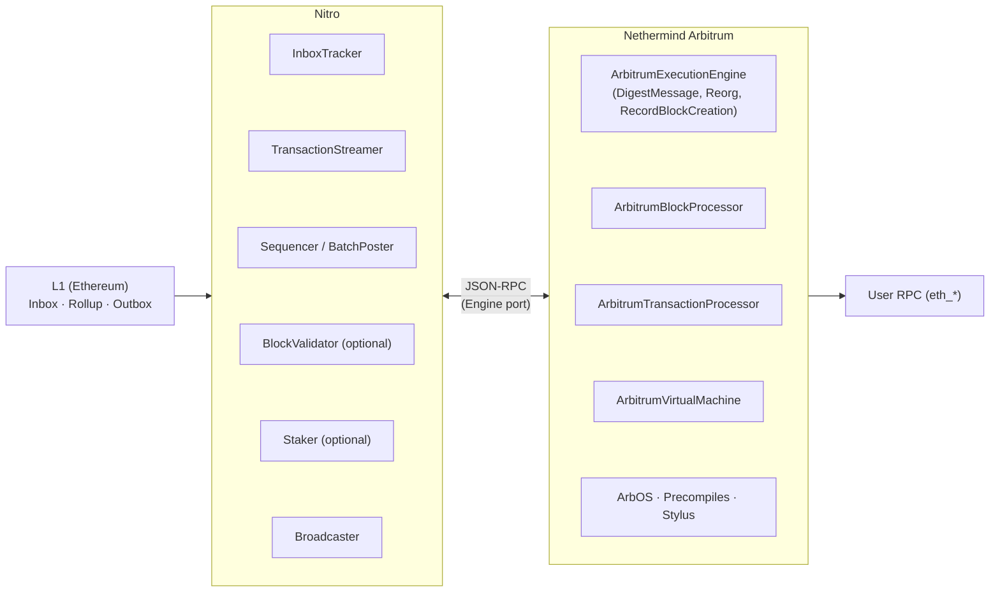
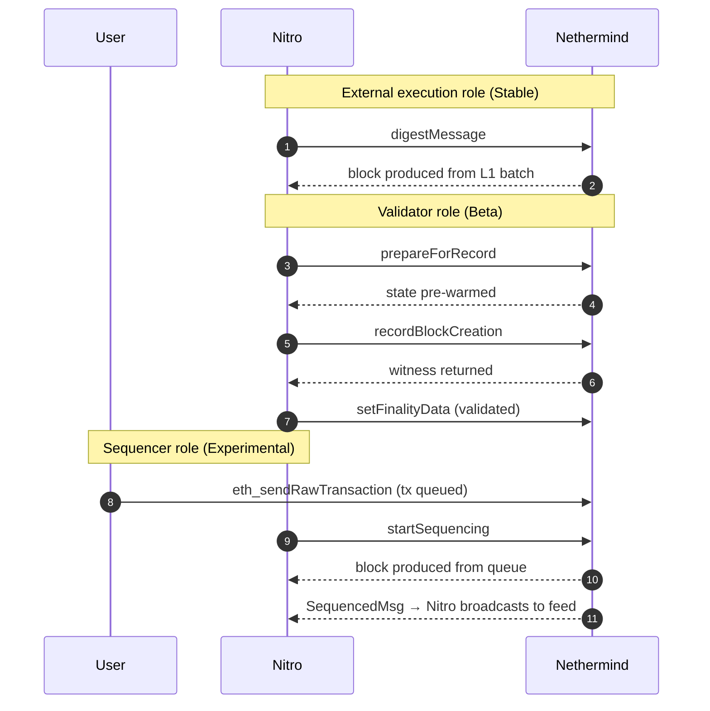
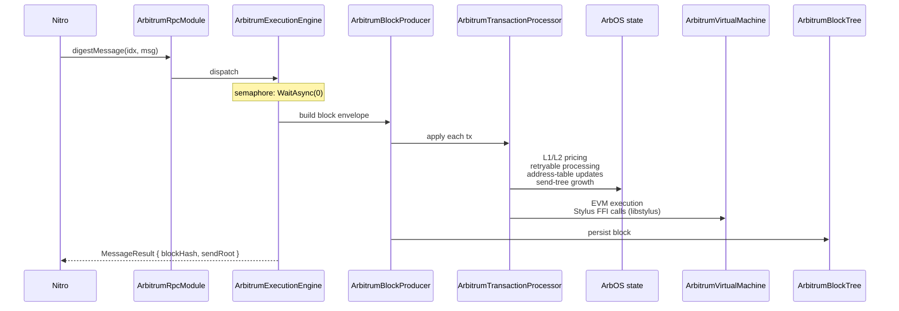
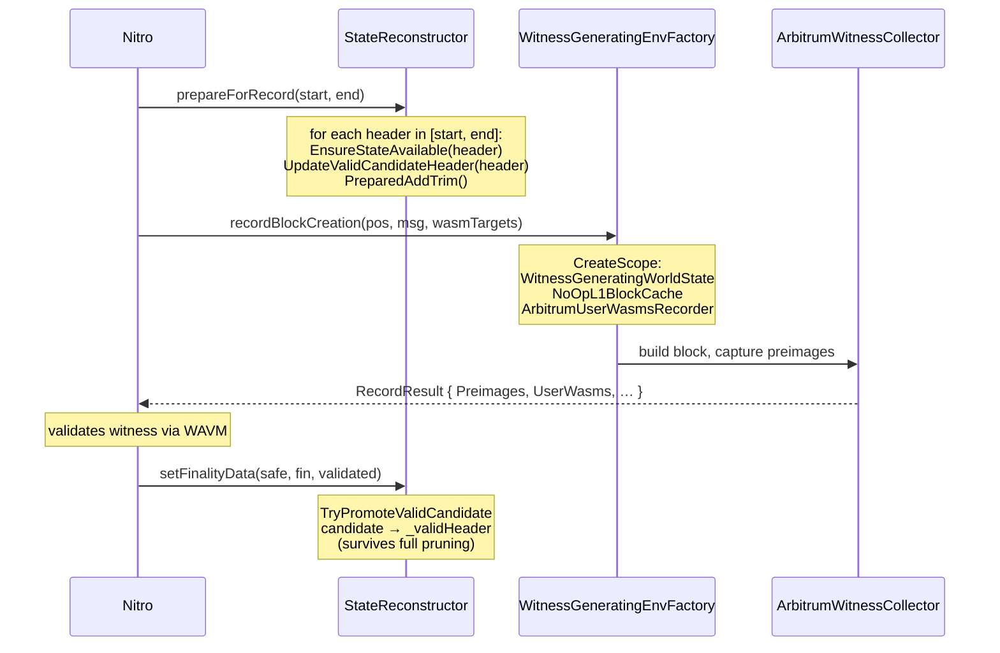
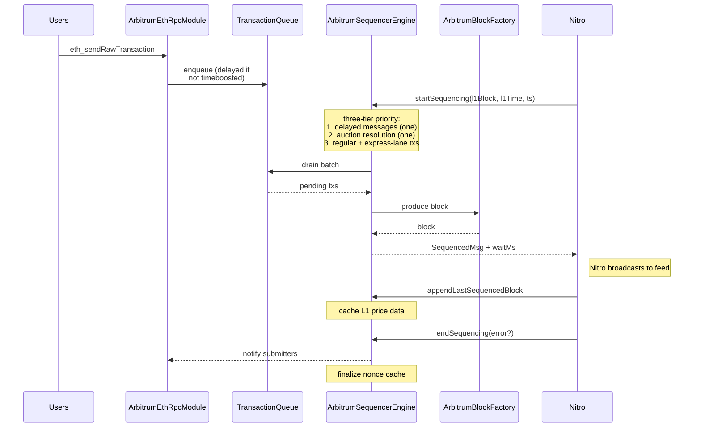

# Architecture

How Nethermind Arbitrum and Nitro fit together. The lens is operational — enough mental model to reason about behavior, plus enough internal structure to find your way in if you contribute.

For protocol-level concepts (what an Arbitrum sequencer is, how ArbOS works, how fraud proofs operate), see [`docs.arbitrum.io`](https://docs.arbitrum.io/). For Nethermind core concepts (sync, state pruning, eth JSON-RPC), see [`docs.nethermind.io`](https://docs.nethermind.io/).

## The Nitro↔Nethermind boundary

An Arbitrum node is two processes:

- **Nitro** (Go) — the consensus client. Reads batches from L1, tracks delayed-message inboxes, broadcasts the feed, runs the validator/staker (when enabled), drives sequencing (when enabled).
- **Nethermind Arbitrum** (C#) — the execution client. Owns chain state, applies messages to produce blocks, runs the EVM and Stylus VM, serves user RPC.

They communicate via JSON-RPC on the Engine port (`20551` by default), authenticated with JWT.



The boundary is intentional: Nitro decides *what* to execute and *when*; Nethermind decides *how*. State lives only on the Nethermind side; L1 communication lives only on the Nitro side. The same Nethermind Arbitrum process can take on any combination of [chain roles](roles/) — external execution, validator, sequencer — based on which Nitro flags are set and which Nethermind config is loaded.

### The three roles mapped onto the boundary



The external execution role is the baseline. Adding the validator role brings in the `prepareForRecord` / `recordBlockCreation` calls plus the validated finality marker. Adding the sequencer role brings in `startSequencing` / `endSequencing` / `enqueueDelayedMessages` and inverts the data flow for new transactions (Nethermind owns the queue rather than receiving fully-ordered blocks). Roles can be combined on the same process — for example, sequencer and external execution.

## Nitro ↔ Nethermind RPC boundary

Nitro pushes; Nethermind responds. Communication is push-based on a roughly 250 ms cadence in steady state.

The full JSON-RPC surface is in [rpc-api.md](rpc-api.md). At a glance:

| Concern | Nitro → Nethermind | Nethermind → Nitro |
|---------|-------------------|--------------------|
| Block production | [`digestMessage`](rpc-api.md#digest-message), [`reorg`](rpc-api.md#reorg) | `MessageResult` (block hash + send root) |
| Sync / finality | [`setConsensusSyncData`](rpc-api.md#set-consensus-sync-data), [`setFinalityData`](rpc-api.md#set-finality-data) | (confirms via response) |
| Validation | [`prepareForRecord`](rpc-api.md#prepare-for-record), [`recordBlockCreation`](rpc-api.md#record-block-creation) | `RecordResult` (witness) |
| Sequencing | [`startSequencing`](rpc-api.md#start-sequencing), [`endSequencing`](rpc-api.md#end-sequencing), [`enqueueDelayedMessages`](rpc-api.md#enqueue-delayed-messages), [`appendLastSequencedBlock`](rpc-api.md#append-last-sequenced-block) | `SequencedMsg` |
| Maintenance | [`triggerMaintenance`](rpc-api.md#trigger-maintenance), [`shouldTriggerMaintenance`](rpc-api.md#should-trigger-maintenance) | `MaintenanceStatus` |

The Engine API on `EnginePort` is JWT-authenticated. The boundary itself is the security perimeter — exposing the engine port to the public is a misconfiguration.

### Health tracking

`ArbitrumClHealthTracker` watches consensus connectivity. It logs `"Waiting for connection from consensus layer..."` every 30 seconds until the first `digestMessage` arrives, then stops. The tracker is heartbeat-based; it only detects the *initial* absence of Nitro, not later disconnections.

## Plugin internals

The plugin extends Nethermind via `IConsensusPlugin`. The entry point is `ArbitrumPlugin.cs`. Plugin lifecycle:

```
Init                      → Read config, prepare API
InitTxTypesAndRlpDecoders → Register Arbitrum-specific tx decoders
InitRpcModules            → Register the nitroexecution / arbitrum / debug RPC modules
InitBlockProducer         → Construct the block producer (sequencer role only)
InitBlockProducerRunner   → Wire the runner that drives block production
```

Three Autofac-bound modules compose the Arbitrum service graph:

| Module | Always loaded | Purpose |
|--------|--------------|---------|
| `ArbitrumModule` | yes | Core: block tree, spec provider, transaction processor, EVM, ArbOS, precompiles, Stylus DB. |
| `ArbitrumValidatorModule` | when [`ValidationEnabled = true`](configuration.md#validation-enabled) | StateReconstructor, witness factories, full-pruner wrapper. |
| `ArbitrumSequencerModule` | when [`SequencerEnabled = true`](configuration.md#sequencer-enabled) | Sequencer engine, transaction queues, Timeboost express-lane services. |

The modules nest: every node has `ArbitrumModule`; the validator and sequencer roles are independent overlays on top, and either or both can be enabled.

### Component layout

The plugin source lives at `src/Nethermind.Arbitrum/` — namespaces mirror the directory structure. Top-level groupings:

| Directory | What lives there |
|-----------|------------------|
| `Arbos/` | ArbOS state — L1/L2 gas pricing, retryables, address tables, Merkle accumulator. |
| `Config/` | `IArbitrumConfig`, chainspec engine parameters, dynamic spec provider. See [configuration](configuration.md). |
| `Core/` | Cross-cutting types and helpers. |
| `Data/` | Arbitrum transaction types, RPC parameter types, block metadata. |
| `Evm/` | `ArbitrumVirtualMachine`, gas policy, witness-generation hooks. |
| `Execution/` | Block producer, transaction processor, block tree, stateless validation. |
| `Genesis/` | Genesis initialization (chainspec + `DigestInitMessage` paths). |
| `Modules/` | RPC modules — `nitroexecution`, `arbitrum`, `debug`, plus `eth_*` overrides. |
| `Precompiles/` | Arbitrum system contracts at `0x64`–`0x73`, `0xff`. |
| `Properties/` | Shipped configs, chainspecs, account fixtures, scripts. |
| `Rpc/` | RPC-side helpers (block formatting, consensus client, block-metadata cache). |
| `Sequencer/` | Sequencer engine, queues, Timeboost. |
| `Stylus/` | WASM database, store, Wasmer FFI bootstrap. |
| `Tracing/` | EVM tracing extensions. |

## Block production data flow

The path a single message takes in the [external execution role](roles/external-execution.md):



## Validation flow {#validation-flow}

When the [validator role](roles/validator.md) is enabled, Nitro asks Nethermind for execution witnesses rather than just blocks.

The mechanism uses a stateless approach: instead of maintaining a permanent second copy of state, the validator reconstructs only what it needs, captures a witness, then releases. State lives in a MemDb overlay (`ReconstructedStateTrieStore`) with reference counting.



### Why stateless

A traditional validator maintains a full second copy of state — hundreds of GB, tightly coupled to pruning. The stateless approach decouples validation from state persistence. The validator only needs:

1. The block tree (headers + bodies) — lightweight, always available.
2. The ability to reconstruct state on demand by re-executing from the nearest known-good checkpoint.
3. A way to capture what was accessed — the witness.

Memory pressure is bounded by [`ValidatorMaxStateRootsInMem`](configuration.md#validator-max-state-roots-in-mem) and [`ValidatorReconstructedStateMemDBMaxSizeMb`](configuration.md#validator-reconstructed-state-memdb-max-size-mb). When pressure builds, `MaybeCap` spills oldest roots to disk via `DereferenceAndSpill`.

### Pruning coordination

When Nethermind runs full pruning (replacing the underlying RocksDB), the validator must (a) copy its `_validHeader` state to the new DB before the swap, and (b) block validator operations until pruning commits. `ArbitrumFullPrunerFactory` wraps the standard pruner with `ValidatorStatePreservingStateReader` to handle (a). A `_pruningGate` `TaskCompletionSource` handles (b).

## Sequencer flow

When the [sequencer role](roles/sequencer.md) is enabled, Nethermind owns the transaction queue and produces blocks on demand from Nitro:



`AppendLastSequencedBlock` must complete before the next `StartSequencing` — this is a hard invariant.

The sequencer is a **block factory that does not decide when to produce** — that is consensus's job. It only decides what goes into each block. See the [sequencer role page](roles/sequencer.md) for transaction priorities, conditional transactions (EIP-7796), and Timeboost express-lane mechanics.

## Transaction types

Six Arbitrum-specific transaction types, plus standard Ethereum types:

| Type | Description |
|------|-------------|
| `ArbitrumInternalTx` | Internal system transactions (e.g. ArbOS upgrades). |
| `ArbitrumDepositTx` | L1-to-L2 deposits. |
| `ArbitrumUnsignedTx` | Unsigned messages from L1. |
| `ArbitrumRetryTx` | Retryable ticket redemptions. |
| `ArbitrumSubmitRetryableTx` | Submission of retryable tickets. |
| `ArbitrumContractTx` | Contract-initiated transactions. |

EIP-4844 blob transactions are explicitly disabled at the L2 level (`TxPool.BlobsSupport: "Disabled"`).

For the protocol-level meaning of these types, see [Arbitrum docs on L1-to-L2 messaging](https://docs.arbitrum.io/how-arbitrum-works/deep-dives/l1-to-l2-messaging).

## ArbOS and version gating

ArbOS is the Arbitrum-specific state-machine layer between transactions and EVM execution: dynamic L1/L2 gas pricing, retryable management, address compression, send-tree maintenance, version-gated features. Each ArbOS version unlocks new features:

| Version | Notable additions |
|---------|------------------|
| v6 | Arbitrum One mainnet genesis. |
| v10 | L1 fees-available accounting (Sepolia genesis). |
| v30 | Stylus / WASM contract support; zombie-account fix. |
| v31 | Stylus fixes (e.g. EVM memory cost for return data). |
| v32 | Stylus charging fixes (local-test chains' default). |
| v40 | Parent block-hash processing. |
| v41 | Native token management precompile methods. |
| v50 | Multi-constraint gas pricing; Stylus stack-depth cap (Dia). |

The active version is read from chainspec at genesis ([`initialArbOSVersion`](configuration.md#initial-arbos-version)) and may be upgraded via `ArbOwner` precompile calls.

For the protocol-level explanation of ArbOS, see [Arbitrum docs on ArbOS](https://docs.arbitrum.io/how-arbitrum-works/deep-dives/arbos).

## Precompiles

Precompiles are special contracts at fixed addresses providing system-level functionality, implemented natively for performance. Implementation lives in `Precompiles/`. The address-to-purpose map is part of the Arbitrum protocol — see [Arbitrum precompiles overview](https://docs.arbitrum.io/build-decentralized-apps/precompiles/overview) for the canonical reference.

Plugin-specific notes:

- The two-file pattern is `ArbXxx.cs` (logic) plus `ArbXxxParser.cs` (ABI dispatch). The parser is generated from Solidity ABI metadata via the [`Nethermind.Arbitrum.Precompiles`](https://github.com/NethermindEth/nethermind-arbitrum-precompiles) NuGet package.
- Version gating is encoded per-feature in `ArbosVersion.cs`. For example, `ArbWasm` is registered only when ArbOS ≥ 30; `ArbNativeTokenManager` only when ArbOS ≥ 41.
- Debug precompiles (`ArbDebug`, `ArbTest`) are gated on the chainspec [`allowDebugPrecompiles`](configuration.md#allow-debug-precompiles) flag — `true` only on local/test chains.

## Stylus / WASM

Stylus enables WebAssembly smart contracts compiled from Rust, C, and other languages. The C# plugin bridges to a native Rust runtime via FFI (`libstylus.so` / `.dylib` / `.dll`).

Plugin-specific concerns:

- The Stylus runtime is shipped as the [`Nethermind.Arbitrum.Stylus`](https://github.com/NethermindEth/nethermind-arbitrum-stylus) NuGet package; bumping it requires a paired bump of `WasmStoreSchema.WasmerSerializeVersion` in lock-step. Skipping the latter ships a node that panics on first Stylus call. See [troubleshooting](troubleshooting.md#stylus-wasmer-incompatible-binary).
- The wasm DB is configured with a `prefix_hash` memtable + `kHashSearch` SST index for point-lookup performance.
- Activated programs are cached as Wasmer-serialized native modules under three target prefixes (`\0wr` ARM, `\0wx` x86, `\0wh` host). The WAVM modules under `\0ww` are platform-independent IR for fraud proofs and live on a separate lifecycle.

For the protocol-level explanation of Stylus, see [Arbitrum docs on Stylus](https://docs.arbitrum.io/stylus/gentle-introduction).
