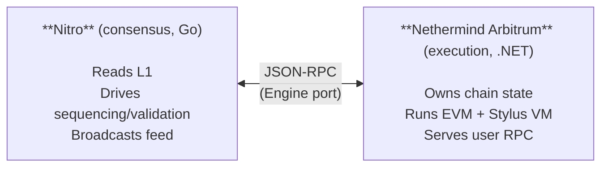

# Nethermind Arbitrum

Nethermind Arbitrum is a Nethermind-based execution client for Arbitrum chains. It plugs into Nitro — the official Arbitrum consensus client from Offchain Labs — and replaces the Geth-based execution layer that ships inside Nitro. The result is an Arbitrum node whose execution side is built on Nethermind's modular architecture.

For the protocol-level explanation of Arbitrum, see [`docs.arbitrum.io`](https://docs.arbitrum.io/get-started/overview). This page assumes you already know what an Arbitrum rollup is and want to know whether to try this client.

## What runs where

For the operational mental model, see [architecture](architecture.md).

## Chain roles

The plugin supports three chain roles. They are not mutually exclusive — the same Nethermind Arbitrum process can carry one role or several at once (for example, sequencer plus external execution). Most node operators run external execution alone.

| Role | Maturity | What it does | Page |
|------|----------|--------------|------|
| **External execution** | Stable | Runs as the execution layer behind a Nitro consensus node. The default. | [external-execution.md](roles/external-execution.md) |
| **Validator** | Beta | Stateless validation — generates execution witnesses on demand for Nitro's protocol validator. | [validator.md](roles/validator.md) |
| **Sequencer** | Experimental | Nethermind owns the transaction queue and produces blocks itself. | [sequencer.md](roles/sequencer.md) |

## Prerequisites

For all roles:

- **Docker + Docker Compose.** The repo's `docker-compose.yml` runs Nethermind Arbitrum and Nitro side by side. Both projects ship as Docker images; bare-metal builds are not the recommended path.
- **Nitro consensus client.** The official `offchainlabs/nitro-node` image is the supported pairing and is wired up in the compose file.
- **Ethereum L1 RPC and Beacon endpoints.** Nitro reads batches from the L1 inbox and blob data from the Beacon API.
- **Disk and memory.** Mainnet pruned: ≈ 1 TB disk, ≥ 24 GiB RAM. Mainnet archive: ≈ 4 TB+. Sepolia: ~2× smaller.

For specific roles, see the per-role prerequisites:

- [External execution prerequisites](roles/external-execution.md#prerequisites)
- [Validator prerequisites](roles/validator.md#prerequisites)
- [Sequencer prerequisites](roles/sequencer.md#prerequisites)

## Resources

- [Nethermind Arbitrum repository](https://github.com/NethermindEth/nethermind-arbitrum) — source and issue tracker.
- [Nitro source](https://github.com/OffchainLabs/nitro) — consensus-side implementation.
- [Arbitrum documentation](https://docs.arbitrum.io/) — protocol concepts.
- [Nethermind documentation](https://docs.nethermind.io/) — core Nethermind concepts (sync, pruning, JSON-RPC).
